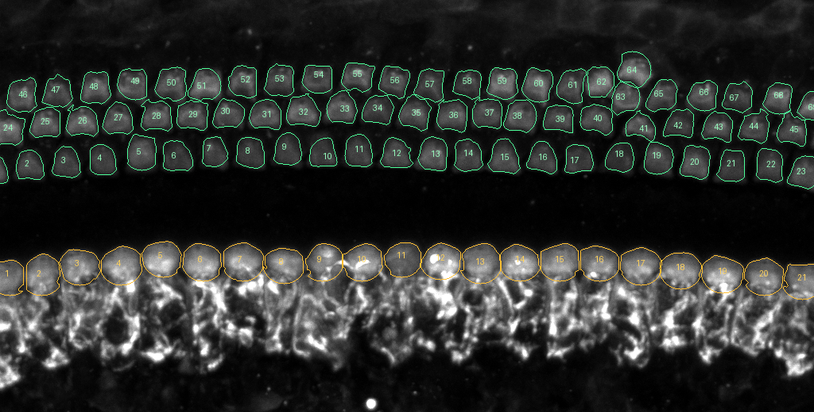

# Control Mid-1 · IHC and OHC example (assistant-curated)

An example of what a correct hair-cell run should look like on the **Hair cells · Control Mid-1 · native 40Z** starter. In the app, choose that image and click **Load example** in the results panel. It imports two reviewable 3D mask runs and adds one labelled 3D point per cell.

**This is not expert ground truth.** The assistant placed and checked every cell visually and built the masks with a classical algorithm. Use it to learn the workflow and compare methods, not to score accuracy. Expert review is still needed.

## Counts

| Population | Cells | Touching the image edge | Notes |
| --- | --- | --- | --- |
| Inner hair cells (IHC) | 21 | 2 (IDs 1 and 21) | One row of large round Myo7a bodies |
| Outer hair cells (OHC) | 69 | 4 | Row 1 (nearest the IHCs) 23, row 2 22, row 3 24 |

Edge cells are partial and included; their points are marked `uncertain`. Apply the lab's edge rule before reporting a count.

**Against the lab's manual count** (`TP_HC Counting.xlsx`, Box file 2466262271146, sheet *Set 1*, PLPCreER-GAP-Control `Mid-1_x20x2`; not yet confirmed to be the same file as Jihyun's *Set1_HC Numbers_Manual Count*; copied to [`../reference-counts/set1-manual-counts.json`](../reference-counts/set1-manual-counts.json)):

| | IHC | OHC row 1 | OHC row 2 | OHC row 3 | OHC4 | Total OHC |
| --- | --- | --- | --- | --- | --- | --- |
| Lab manual count | 21 | 23 | 23 | 24 | 1 | 71 |
| This example | 21 | 23 | 22 | 23 | 1 (ID 64, out of row) | 69 |

The workbook does not define OHC4; matching it to out-of-row cell 64 is an inference. The IHC count matches. The example has two fewer OHCs, one each in rows 2 and 3. No row has a gap in its spacing, so the missing cells are most likely at the left or right image edge. The tissue is tilted, so stereocilia bundles near the edges belong to bodies that lie outside the frame. Body-based masks cannot include those cells. This difference is not resolved; equal totals would not show the same cells were found either.

## How it was made

1. **Channel.** C1, presumed Myo7a. Phalloidin (C3) showed the same layout: three OHC bundle rows and one IHC row. Confirm the channel identities with the lab.
2. **OHC centres.** Peak detection on the smoothed mean of planes 22–38. All 69 candidates were checked on 2× crops and lie on distinct cell bodies. Near X≈790 one cell sits between rows (IDs 63/64); it is kept as a separate cell.
3. **IHC centres.** Placed by hand at the centre of each round body. The automatic detector preferred the bright fibres below the bodies, so it was not used for IHCs.
4. **3D masks.** Seeded watershed on Gaussian-smoothed C1 (σ 0.7 planes, 1.5 px). Each cell gets one seed column through the planes where it has signal. A voxel may only join its nearest seed in XY (OHC ≤ 24 px, IHC ≤ 28 px), within its band. Only the largest connected part of each label is kept. The threshold is Otsu within the band (×0.9 for IHC).
5. **Check.** Outlines were inspected on XY planes 24–31 and on XZ sections through an OHC row and the IHC row.

`tools/make_hair_cell_example.py` rebuilds every file here from `centers.json` and the starter image.

## Known limits

- **IHC masks cover the round Myo7a body only.** The bright, tangled signal below each body is excluded. Whether that signal belongs to IHCs is an open question for the lab; earlier project notes recorded it as unresolved.
- **One IHC mask includes extra signal.** Near X≈455, the mask also picks up a small bright blob just above the body.
- **Masks are threshold boundaries, not traced membranes.** Volumes describe the masks; they are not measured cell volumes.
- **Row assignment is geometric.** It comes from distance to a fitted curve, not from biological identity.

## Files

| File | Contents |
| --- | --- |
| `ihc-labels.tif`, `ohc-labels.tif` | ZYX uint16 instance masks on the 2× XY grid (40 × 512 × 512, 2 × 2 majority vote), zlib-compressed. **Load example** imports these; the 2× grid fits the browser demo's import limit. IDs run left to right (OHC: by row). |
| `ihc-labels-native.tif`, `ohc-labels-native.tif` | The same masks on the full native grid (40 × 1024 × 1024), for other tools or the native server. |
| `annotations.json` | Counts, provenance, and one 3D point per cell labelled e.g. `OHC 12 · row 1`. |
| `cells.csv` | Per cell: type, ID, OHC row, XY centre, Z centre and range, voxels, mask volume (µm³), edge flag. |
| `centers.json` | The reviewed XY centres the masks are built from. |
| `overview.png` | Myo7a maximum projection with numbered outlines. |
